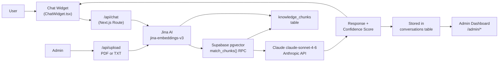

# SmartDesk — AI Customer Support

> **AI-powered chat widget with RAG pipeline, admin dashboard, and knowledge gap detection. Built as a Fiverr portfolio project by Abrar Tajwar Khan.**

🔗 **Live Demo:** [smartdesk-fiyjfdklw-abrartajwar2-6162s-projects.vercel.app](https://smartdesk-fiyjfdklw-abrartajwar2-6162s-projects.vercel.app)  
🐙 **Repo:** [github.com/WarRinOP/smartdesk-ai](https://github.com/WarRinOP/smartdesk-ai)

---

## ✨ Features

| # | Feature | Description |
|---|---------|-------------|
| 1 | **Chat Widget** | Floating chat button → 380px pop-up window with typing indicator, confidence badges, and session persistence |
| 2 | **RAG Pipeline** | PDF/TXT upload → chunk → embed (Jina AI) → store in pgvector → semantic retrieval on every query |
| 3 | **Claude Integration** | Context-aware responses via Claude claude-sonnet-4-6 with configurable persona (Friendly / Professional / Concise) |
| 4 | **Admin Dashboard** | 5-page admin panel: Overview stats, Conversations browser, Knowledge Base manager, Gap Report, Configuration |
| 5 | **Knowledge Gap Detection** | Clusters low-confidence responses by topic so you know exactly what to add to your knowledge base |
| 6 | **Confidence Scoring** | Every AI response scored 0–1; low-confidence answers shown with a yellow warning badge |
| 7 | **Mobile Responsive** | Chat widget goes full-width on mobile; admin sidebar becomes a bottom tab bar |

---

## 🛠 Tech Stack

| Layer | Technology |
|-------|-----------|
| Framework | Next.js 16 (App Router, TypeScript) |
| Styling | Tailwind CSS v4, custom dark design tokens |
| Database | Supabase PostgreSQL + pgvector |
| Vector Search | Supabase `match_chunks()` RPC (cosine similarity) |
| Embeddings | Jina AI `jina-embeddings-v3` (512 dims) via REST API |
| LLM | Anthropic Claude claude-sonnet-4-6 |
| File Parsing | `pdf-parse` (Node.js) |
| Deployment | Vercel (frontend + API routes) |
| Auth | None — demo build (add Supabase Auth for production) |

---

## 🏗 Architecture



---

## 🚀 Setup Instructions

### 1. Clone the repository
```bash
git clone https://github.com/WarRinOP/smartdesk-ai.git
cd smartdesk-ai
npm install
```

### 2. Create a Supabase project
1. Go to [supabase.com](https://supabase.com) and create a new project
2. In the SQL Editor, run the migration file:
   ```
   supabase/migrations/001_initial_schema.sql
   ```
3. This creates three tables (`knowledge_chunks`, `conversations`, `bot_config`) and the `match_chunks()` vector search function

### 3. Set environment variables
Copy the example file and fill in your values:
```bash
cp .env.local.example .env.local
```

Then edit `.env.local` — see the table below for each variable.

### 4. Seed demo data (optional)
Start the dev server and hit the seed endpoint:
```bash
npm run dev
curl -X POST http://localhost:3000/api/seed
```
This loads the Bella Vista Bistro demo knowledge base.

### 5. Run locally
```bash
npm run dev
```
Open [http://localhost:3000](http://localhost:3000) — the chat widget is bottom-right.  
Admin panel: [http://localhost:3000/admin](http://localhost:3000/admin)

---

## 🔑 Environment Variables

| Variable | Required | Description |
|----------|----------|-------------|
| `NEXT_PUBLIC_SUPABASE_URL` | ✅ | Your Supabase project URL (e.g. `https://xxx.supabase.co`) |
| `NEXT_PUBLIC_SUPABASE_ANON_KEY` | ✅ | Supabase anon/public key — safe to expose in browser |
| `SUPABASE_SERVICE_ROLE_KEY` | ✅ | Supabase service role key — **server-only**, never expose |
| `JINA_API_KEY` | ✅ | [jina.ai](https://jina.ai/embeddings/) — free tier, 1M tokens, no card needed |
| `ANTHROPIC_API_KEY` | ✅ | [console.anthropic.com](https://console.anthropic.com) — add $5 credits to activate |

---

## 📁 Project Structure

```
/
├── app/
│   ├── page.tsx                 # Public landing page + chat widget
│   ├── admin/
│   │   ├── layout.tsx           # Admin layout (sidebar + bottom tabs)
│   │   ├── page.tsx             # Overview: stats + conversation table
│   │   ├── conversations/       # Full conversation browser
│   │   ├── knowledge/           # File upload + knowledge table
│   │   ├── gaps/                # Knowledge gap report
│   │   └── config/              # Bot configuration form
│   └── api/
│       ├── chat/                # RAG chat endpoint
│       ├── upload/              # Document ingest endpoint
│       ├── conversations/       # Session fetch endpoint
│       ├── config/              # Bot config GET/PUT
│       ├── stats/               # Dashboard metrics
│       ├── chunks/              # Knowledge file management
│       ├── gaps/                # Gap clustering via Claude
│       └── seed/                # Demo data seed endpoint
├── components/
│   ├── chat/                    # TypingIndicator, MessageBubble, ChatWidget
│   ├── admin/                   # All admin dashboard components
│   └── ui/                     # Button, Card, Badge, FileUpload
├── lib/
│   ├── rag.ts                   # Jina embed + chunk + retrieve functions
│   ├── claude.ts                # Anthropic SDK wrapper
│   ├── supabase.ts              # Browser + server Supabase clients
│   ├── pdf.ts                   # PDF + TXT file parsing
│   └── seed.ts                  # Demo knowledge base content
└── supabase/migrations/         # SQL schema + vector search function
```

---

## 💡 How It Works

1. **Upload** a PDF or TXT document via the admin Knowledge Base page
2. The document is **chunked** into ~500-character segments with 50-char overlap
3. Each chunk is **embedded** into a 512-dimensional vector via Jina AI
4. Vectors and content are **stored** in Supabase `knowledge_chunks` table
5. When a user sends a message, the message is also **embedded**
6. The **4 most similar chunks** are retrieved via cosine similarity (`match_chunks()`)
7. Retrieved chunks + user message → **Claude** generates a contextual response
8. The response + a confidence score are **returned** to the widget and **stored** in the database
9. Low-confidence responses (< 0.5) are flagged with a yellow badge and surfaced in the admin **Gap Report**

---

## 🗺 Roadmap

- [ ] Supabase Auth — protect admin panel behind login
- [ ] Conversation handoff — escalate to human agent via email/Slack
- [ ] Multi-language support
- [ ] White-label theming for client deployments
- [ ] Vercel Analytics integration

---

## 👨‍💻 About

**Built by Abrar Tajwar Khan** — Full-stack developer specializing in AI-powered web applications.

> 💼 Available for custom AI development, chatbot builds, and RAG pipeline projects on Fiverr.  
> 📧 Contact: via GitHub or Fiverr profile

---

*SmartDesk is a portfolio demonstration project. The Bella Vista Bistro demo data is fictional.*
